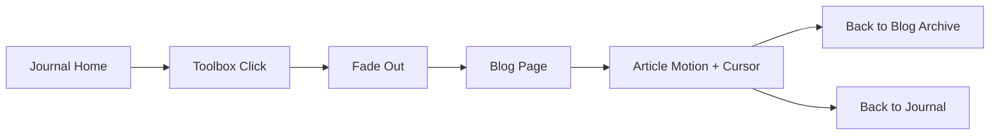

# The Scribbler's Journal

The Scribbler's Journal is a static HTML, CSS, and JavaScript notebook-style site. The main journal opens into a Toolbox, and each Toolbox item flows into a matching blog page with the same paper-and-ink visual language, smooth transitions, and a custom cursor.

## Quick Flow

Open the journal, click a Toolbox item, watch the page transition, read the article, and use the navigation buttons to return.



## What Lives Here

- `journalist_narrative/index.html` opens the main notebook.
- `journalist_narrative/blogs/index.html` lists the blog archive.
- The Toolbox routes `JS`, `TS`, `RE`, `ND`, `PY`, `PS`, and `TW` to their matching pages.
- Blog pages share the same article structure, animation layer, and cursor behavior.

## User Experience

1. The journal loads with the paper theme and custom cursor.
2. A Toolbox click triggers a clean exit transition.
3. The matching blog page opens with entrance animation.
4. Headings, tags, and content reveal in sequence.
5. The reader can return to the archive or the journal at any time.

## Blog Pages

The current tech pages are:

- JavaScript
- TypeScript
- React
- Node.js
- Python
- PostgreSQL
- Tailwind CSS

Each page uses the same shared layout so the experience feels consistent from page to page.

## Animation And Interaction

- Page enter animation on load
- Page exit animation before navigation
- Staggered reveal for content blocks
- Smooth scroll-to-top behavior
- Shared custom cursor on fine-pointer devices
- Keyboard support for back and forward navigation

## Important Files

- [Main journal](journalist_narrative/index.html)
- [Main journal script](journalist_narrative/script.js)
- [Main journal styles](journalist_narrative/styles.css)
- [Blog archive](journalist_narrative/blogs/index.html)
- [Blog routing](journalist_narrative/blogs/toolbox-system.js)
- [Blog cursor](journalist_narrative/blogs/blog-cursor.js)
- [Blog animations](journalist_narrative/blogs/blog-animation.js)
- [Blog styles](journalist_narrative/blogs/blog-styles.css)

## Routing Map

- `JS` -> `javascript-guide.html`
- `TS` -> `typescript-guide.html`
- `RE` -> `react-guide.html`
- `ND` -> `nodejs-guide.html`
- `PY` -> `python-guide.html`
- `PS` -> `postgresql-guide.html`
- `TW` -> `tailwind-guide.html`

## Running Locally

Open `journalist_narrative/index.html` in a browser. No build step is required.

## Editing Rules

- Keep blog links relative to the `blogs/` folder.
- Update the Toolbox mapping and archive together when adding a post.
- Keep shared behavior in the blog scripts instead of duplicating it in each page.
- Keep the root README as the single documentation file for the repo.

## Project Structure

```text
developer_notebook/
├── README.md
└── journalist_narrative/
		├── index.html
		├── script.js
		├── styles.css
		└── blogs/
				├── index.html
				├── blog-cursor.js
				├── blog-animation.js
				├── blog-styles.css
				├── toolbox-system.js
				└── *.html
```

## Summary

This repo now uses one README as the single guide for the journal and blog system. It explains the interaction flow, routing, and shared motion so future edits stay consistent.